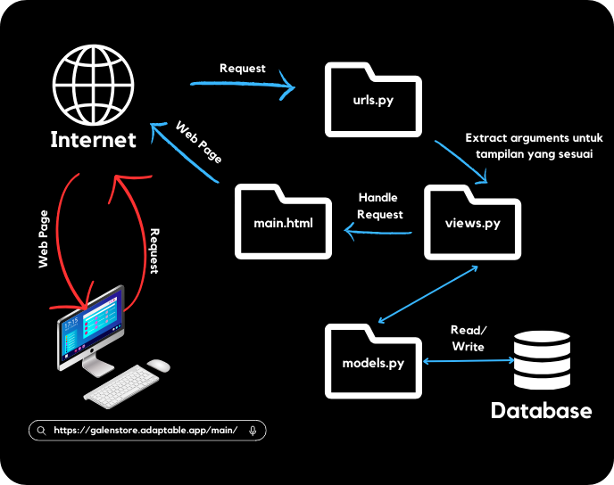
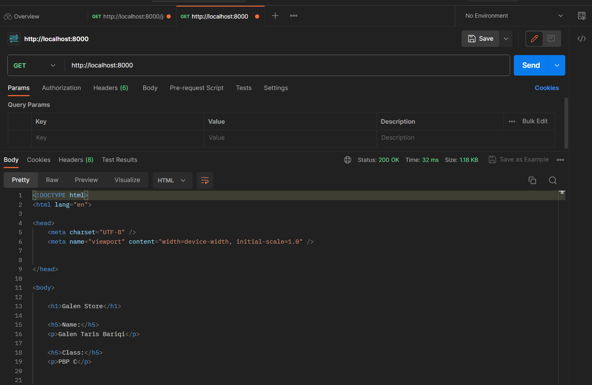
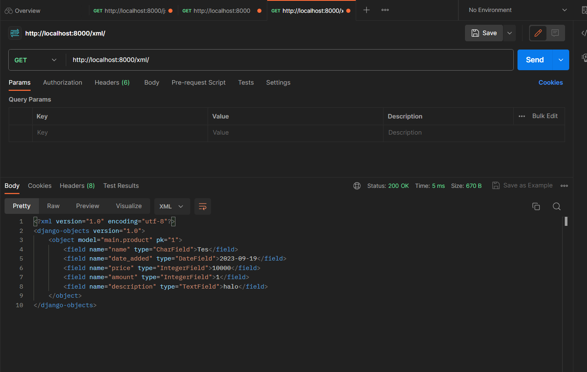
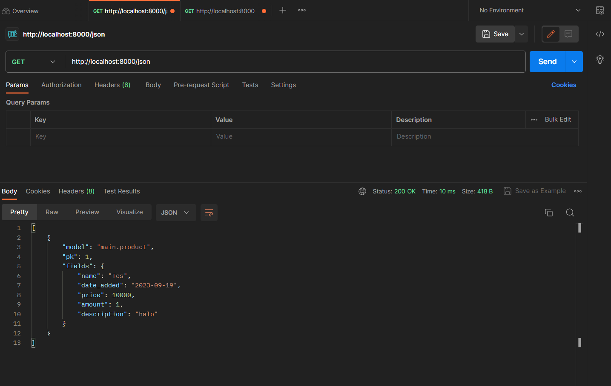
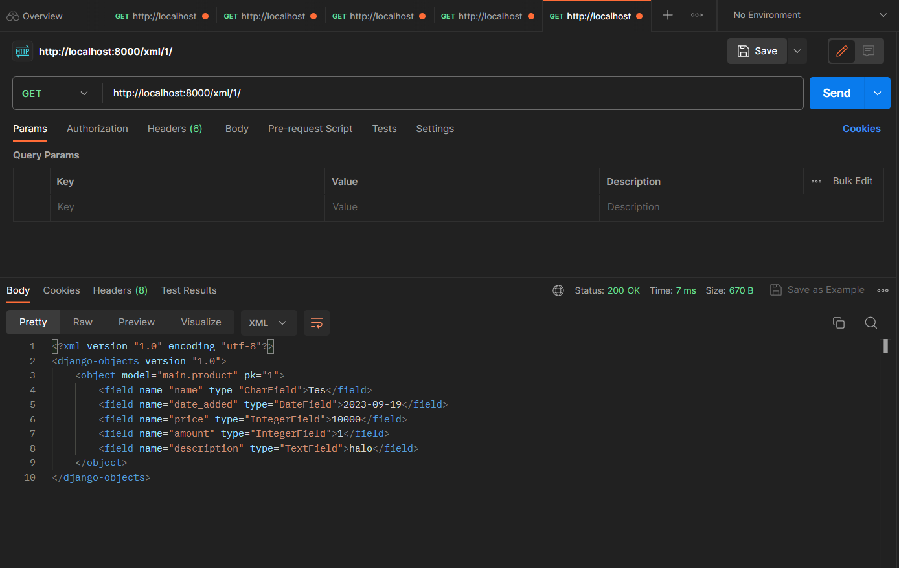
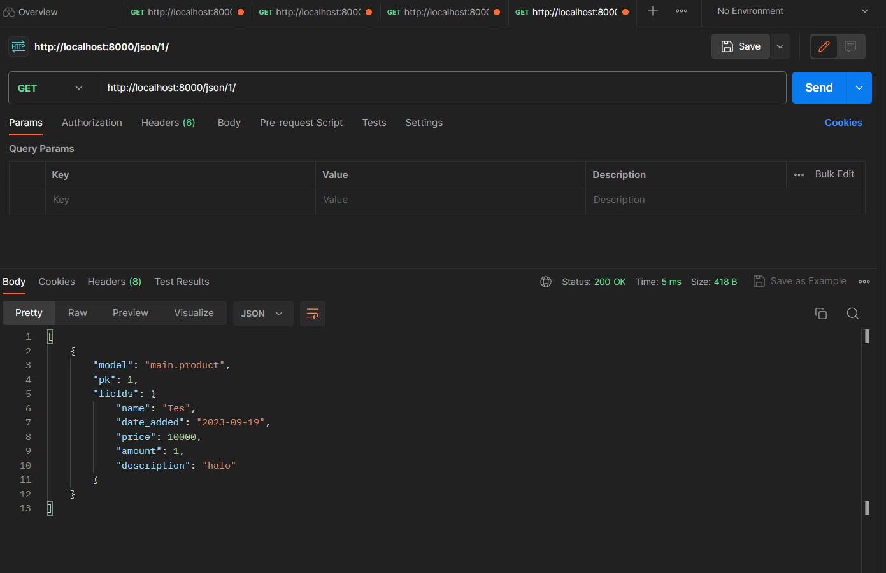

# Galen Store

#### Nama : Galen Taris Bariqi
#### NPM : 2206029052
#### Kelas : PBP C


#### TUGAS 2

Link Adaptable : https://galenstore.adaptable.app/main/

<details>
<summary>
1. Jelaskan bagaimana cara kamu mengimplementasikan checklist di atas secara step-by-step (bukan hanya sekadar mengikuti tutorial).
</summary>

- Membuat sebuah proyek Django baru.

Seperti yang sudah diajarkan saat tutorial 0 kemarin, saya harus membuat repositori public di github yang terhubung dengan repositori lokal di laptop. Repositori lokal tersebut berisi proyek aplikasi yang dibuat pada tugas 2 ini. Untuk membuat direktori tersebut, kita harus menggunakan beberapa command seperti :
    1. ``git init`` : Menginisiasi di direktori yang sudah dibuat dan akan membuat repositori kosong di direktori tersebut
    2. ``python -m venv env`` : Membuat virtual environment (env)
    3. ``env\Scripts\activate.bat`` : Mengaktivasi env tersebut yang akan berguna sebagai *dependecies* dari aplikasi.
    Kemudian membuat berkas requirements.txt saat env sedang aktif yang berisi beberapa *dependecies*
    4. ``pip install -r requirements.txt`` : Menjalankan *dependecies* yang sudah dimasukkan ke dalam berkas requirements.txt
    5. ``django-admin startproject galen_store .`` : Membuat proyek Django dengan nama "galen_store"

Untuk memberikan izin pada semua host dalam mengakses aplikasi web, kita harus menambahkan ``"*"`` dalam ``ALLOWED_HOSTS``. Dan yang terakhir adalah membuat berkas ``.gitignore`` dan diisi dengan text pada tutorial 0. Berkas tersebut berguna untuk mengabaikan beberapa berkas yang harus diabaikan oleh git agar tidak ter-push.

- Membuat aplikasi dengan nama main pada proyek tersebut.

Langkah selanjutnya adalah membuat direktori bernama main dalam proyek aplikasi Tugas 2 ini dengan menjalankan perintah ``python manage.py startapp main``. Kemudian menambahkan ``'main'`` ke dalam ``INSTALLED_APPS`` di ``settings.py`` direktori galen_store.

- Melakukan routing pada proyek agar dapat menjalankan aplikasi main.

Di tahap ini, saya membuat berkas urls.py untuk mendefinisikan rute URL. Kemudian, pada file urls.py yang di direktori galen_store, saya menambahkan fungsi include dari django.urls untuk mengimpor rute URL dari aplikasi lain. Setelah itu, saya menambahkan path ``'main/'`` ke dalam urls.py yang berada di direktori galen_store.

- Membuat model pada aplikasi main dengan nama Item dan memiliki atribut wajib sebagai berikut.
    1. name sebagai nama item dengan tipe CharField.
    2. amount sebagai jumlah item dengan tipe IntegerField.
    3. description sebagai deskripsi item dengan tipe TextField.

Saya membuat model-model pada aplikasi main dengan ketentuan di atas pada berkas models.py dengan meng-import class models dari django.db dan kemudian model tersebut dimigrasi untuk mengubah struktur tabel basis data sesuai perubahan yang saya lakukan. Untuk membuat migrasi model, saya menjalankan perintah ``python manage.py makemigrations`` dan menerapkan ke basis data lokal dengan ``python manage.py migrate``. 

- Membuat sebuah fungsi pada views.py untuk dikembalikan ke dalam sebuah template HTML yang menampilkan nama aplikasi serta nama dan kelas kamu.

Pertama-tama, saya mengimpor render dari django.shortcuts dengan perintah from django.shortcuts import render yang berguna untuk melakukan rendering pada tampilan HTML memakai data yang saya masukkan di file views.py. Saya membuat fungsi show_main pada berkas tersebut yang berisikan sebuah context berupa nama aplikasi, nama lengkap, serta kelas saya. Dan yang terakhir, saya melakukan return terhadap fungsi tersebut berupa ``return render(request, "main.html", context)`` agar data-data yang sudah saya masukkan dapat ditampilkan HTML-nya pada web server.

- Membuat sebuah routing pada urls.py aplikasi main untuk memetakan fungsi yang telah dibuat pada views.py.

Dari berkas urls.py pada direktori main yang sudah dibuat sebelumnya, saya meng-import fungsi show_main tersebut agar path yang mengarahkan ke fungsi tersebut bisa dimasukkan ke urlspattern di berkas tersebut.

- Melakukan deployment ke Adaptable terhadap aplikasi yang sudah dibuat sehingga nantinya dapat diakses oleh teman-temanmu melalui Internet.

Langkah terakhir setelah semua step di atas dilakukan adalah melakukan commit dan push ke repositori git yang dibuat sebelumnya. Pertama melakukan command ``git add .`` untuk menandai semua berkas yang akan di track. Kemudian melakukan perintah ``git commit -m "KOMENTAR"`` untuk meng-commit dengan pesan sesuai perubahan yang saya lakukan. Lalu, saya menjalankan perintah ``git remote add origin "URL_REPO"`` untuk menghubungkan repositori lokal dengan repositori yang ada di git. Dan yang terakhir melakukan perintah ``git push -u origin main`` untuk mengirim semua perubahan yang dilakukan ke branch main di repositori git.

</details>

<details>
<summary>
2. Buatlah bagan yang berisi request client ke web aplikasi berbasis Django beserta responnya dan jelaskan pada bagan tersebut kaitan antara urls.py, views.py, models.py, dan berkas html.
</summary>



Untuk kaitan antara berkas, urutan proses langkahnya sebagai berikut :
    1. User me-request permintaan berupa HTTP aplikasi main.html melalui web browser.
    2. urls.py akan menentukan URL dan view mana yang sesuai dengan request dari user.
    3. views.py akan menghandle request dari user sehingga menampilan main.html
    4. Di saat yang bersamaan, views.py menggunakan model yang telah didefinisikan pada models.py untuk memanipulasi data yang diperlukan sehingga dapat merender page yang diinginkan user.
</details>


<details>
<summary>
3. Jelaskan mengapa kita menggunakan virtual environment? Apakah kita tetap dapat membuat aplikasi web berbasis Django tanpa menggunakan virtual environment?
</summary>

Virtual Environment (env) itu berguna untuk mengisolasi package dan dependacies yang diinginkan oleh developer sehingga tidak saling bertabrakan dengan konfigurasi proyek-proyek versi lain. *Dependecies* merupakan modul yang yang diperlukan suatu software agar dapat berfungsi termasuk library, framework, atau package dan tiap proyek tersebut pasti memiliki *dependecies* yang berbeda. Selain itu, virtual environment juga memudahkan developer untuk me-manage *dependecies* dengan menginstall dan menghapus modul-modul Python menggunakan pip. Hal tersebut memudahkan developer dalam mengembangkan proyek yang memerlukan banyak *dependecies*. Virtual environment juga membantu untuk mengurangi risiko terinstall modul-modul yang tidak terpercaya.

Tanpa virtual environment, kita dapat tetap membuat aplikasi web berbasis django, tetapi hal tersebut tidak disarankan karena dependencies proyek secara global di Python mungkin terinstall dan akan menyebabkan konflik antar proyek sehingga sulit dikelola. Penggunaan virtual environment merupakan praktik terbaik dalam mengembangkan aplikasi web berbasis django untuk menghindari masalah dependencies sehingga isolasi antar proyek dapat terjadi. 
</details>

<details>
<summary>
4. Jelaskan apakah itu MVC, MVT, MVVM dan perbedaan dari ketiganya.
</summary>

##### MVC (Model View Controller)
Model = mengelola data dan mengembalikan operasi berupa logic data kepada controller.
View = tampilan yang digunakan untuk menampilkan data dan menerima input dari pengguna.
Controller = mengambil input dari View dan berinteraksi dengan Model untuk memproses data dan diperbarui tampilannya.

MVC adalah pola desain arsitektur pada software yang digunakan untuk mengorganisir suatu kode dalam aplikasi agar pengguna memungkinkan untuk mengelola dan memodifikasinya secara independen. 

##### MVT (Model View Template)
Model = mengelola data dan mengembalikan operasi berupa logic data kepada controller.
View = mengatur tampilan data kepada pengguna.
Template = menentukan tampilan dari data yang disediakan oleh model berupa HTML.

MVT adalah pola desain arsitektur pada software yang terutama dikaitkan dengan kerangka kerja web Django. Template pada MVT berfungsi untuk memisahkan logika tampilan dan logika aplikasi agar developer dapat fokus mengembangkan tampilan tanpa menghiraukan detail logika data pada pemrosesan HTTP.

##### MVVM (Model View View Model)
Model = mengelola data dan mengembalikan operasi berupa logic data kepada controller.
View = mengatur tampilan data kepada pengguna.
ViewModel = mengkonversi data dari model sehingga dapat sesuai dengan tampilan yang diinginkan oleh View.

MVVM adalah pola desain arsitektur pada software yang umumnya digunakan untuk pengembangan dalam aplikasi yang berbasis GUI. MVVM ini berfokus pada pengembangan aplikasi yang punya tampilan kompleks sehingga perlu untuk memisahkan logika tampilan dari logika bisnis.

Intinya penggunaan dari masing-masing pola desain diatas tergantung pada teknologi yang digunakan dan kebutuhan proyek oleh developer. 

</details>

#### TUGAS 3

<details>
<summary>
1. Apa perbedaan antara form POST dan form GET dalam Django?
</summary>

form POST:
- Cara Pengiriman Data
Data yang dikirim dan di*request* oleh user dalam bentuk permintaan HTTP sehingga tidak terlihat di URL. Cocok untuk mengirim berbagai data sensitif seperti *password*.
- Tipe Data yang dapat dikirim
Digunakan untuk mengirim berbagai jenis data, termasuk .txt, .jpg, dll dengan kapasitas yang besar.
- Dari segi User
User lebih sulit untuk menjadikan URL-nya sebagai bookmark karena parameternya tidak pada URL.

form GET:
- Cara Pengiriman Data
Data yang dikirim dalam bentuk parameter dalam URL sehingga data dapat lebih mudah terlihat di URL. Cocok untuk data yang tidak punya dampak apabila dipanggil berulang kali.
- Tipe Data yang dapat dikirim
Digunakan untuk mengirim jenis data yang sederhana dengan kapasitas yang lebih kecil.
- Dari segi User
User dapat dengan mudah untuk menjadikan URL-nya sebagai bookmark karena parameternya ada pada URL.

</details>

<details>
<summary>
2. Apa perbedaan utama antara XML, JSON, dan HTML dalam konteks pengiriman data?
</summary>

- XML
XML mampu mendefinisikan struktur data yang kompleks dengan fleksibel untuk melakukan pertukaran data antar sistem yang beda karena sintaksnya yang cukup kaya dan ketat. Selain untuk menukar data, XML digunakan juga untuk mengkonfigurasi data dan menyimpan data.

- JSON
Tujuan utama dari JSON sama seperti XML yaitu sebagai format pertukaran data yang lebih ringkas sehingga lebih sering digunakan untuk mengirim data server ke browser dan juga sebaliknya. Dengan sintaksnya yang sederhana, JSON lebih mudah dibaca oleh *human* dan ukuran filenya lebih kecil jika dibandingkan dengan XML.

- HTML
Berbeda dengan XML dan JSON, HTML berfokus untuk mengatur tampilan pada halaman web dan mengatur elemen-elemen yang dipakai sehingga web tersebut dapat diakses di browser dan menampilkan berbagai informasi kepada *user*. 

</details>

<details>
<summary>
3. Mengapa JSON sering digunakan dalam pertukaran data antara aplikasi web modern?
</summary>

Pada era web modern ini, tentunya dibutuhkan kecepatan pengiriman data yang tinggi. Dengan sintaksnya yang sederhana, JSON memiliki beberapa keunggulan : 

a. Sintaksnya sederhana
Dengan kesederhanaan sintaks JSON, dapat memudahkan pengguna dan developer untuk memahami dan membaca struktur data yang telah melalui proses pertukaran data.

b. Ukuran file yang kecil
JSON mengirim data dengan ukuran file yang kecil sehingga dapat mempercepatan proses pertukaran data melalui jaringan agar web bisa lebih responsif. 

c. Penggunaan bahasa pemrograman yang fleksibel
JSON dapat digunakan dengan hampir seluruh bahasa pemrograman sehingga memudahkan developer untuk mengembangkan sebuah web.

d. Didukung oleh penggunaan JavaScript
Memudahkan komunikasi dengan server JSON tanpa melakukan banyak konversi

e. Memudahkan Deserialization
Developer dapat dengan mudah mengubah data menjadi data sesuai dengan bahasa pemrograman yang digunakan tanpa memerlukan kode yang banyak.

</details>

<details>
<summary>
4. Jelaskan bagaimana cara kamu mengimplementasikan checklist di atas secara step-by-step (bukan hanya sekadar mengikuti tutorial).
</summary>

- Membuat input form untuk menambahkan objek model pada app sebelumnya.

Sebelum membuat form untuk menambahkan product pada aplikasi, saya membuat folder ``templates`` pada ``root folder`` dan membuat berkas ``base.html`` sebagai kerangka umum halaman web lainnya pada aplikasi Galen Store. Kemudian saya melakukan beberapa *adjust* agar ``main.html`` yang dibuat pada tugas 2 kemarin bisa terhubung. 

Lalu, pada direktori ``main``, saya membuat berkas ``forms.py`` untuk membuat struktur form yang bisa menerima input data pada halaman web. Saya menambahkan kode berikut ini pada forms.py
```
from django.forms import ModelForm
from main.models import Product

class ProductForm(ModelForm):
    class Meta:
        model = Product
        fields = ["name", "price", "amount", "description"]
```

Pada list fields tersebut, saya memasukkan name, price, amount, dan description. Sedangkan untuk date_added akan diinput secara otomatis.

Kemudian saya mengimport beberapa library yang dibutuhkan dan membuat fungsi create_product pada berkas ``views.py``. Fungsi tersebut dibuat untuk melakukan penambahan data secara otomatis ketika dari ``forms.py`` ada data yang disubmit. Tidak lupa juga, setelah saya membuat fungsi create_product, saya menambahkan path url ke ``urlpatterns`` pada ``urls.py`` di main.

Dan pada fungsi show_main dari tugas 2 kemarin, saya menambahkan kode 
```
products = Product.objects.all()
```
Kode diatas berguna untuk mengambil semua object Product pada database.

Kemudian untuk menampilkan fungsi create_product yang sudah dibuat sebelumnya, saya membuat berkas baru bernama ``create_product.html`` pada direktori ``main/templates``. Saya melakukan beberapa adjusting terhadap berkas ``create_product.html`` dan ``main.html`` sehingga tampilannya sesuai apa yang saya harapkan.

- Tambahkan 5 fungsi views untuk melihat objek yang sudah ditambahkan dalam format HTML, XML, JSON, XML by ID, dan JSON by ID.

Kemudian, tahap selanjutnya saya membuat 4 fungsi yang berguna untuk melihat data-data yang sudah diinput oleh user pada web. Data-data tersebut dapat dilihat dengan format yang beragam seperti HTML, XML, dan JSON. 

4 fungsi tersebut bernama show_xml, show_json, show_xml_by_id, dan show_json_by_id. Tiap fungsi tersebut ditambahkan return function berupa ``HttpResponse`` yang sudah di serealize menjadi bahasa pemrograman yang sesuai.

Berikut kode yang saya buat terhadap 4 fungsi tersebut : 
```
def show_xml(request):
    data = Product.objects.all()
    return HttpResponse(serializers.serialize("xml", data), content_type="application/xml")

def show_json(request):
    data = Product.objects.all()
    return HttpResponse(serializers.serialize("json", data), content_type="application/json")

def show_xml_by_id(request, id):
    data = Product.objects.filter(pk=id)
    return HttpResponse(serializers.serialize("xml", data), content_type="application/xml")

def show_json_by_id(request, id):
    data = Product.objects.filter(pk=id)
    return HttpResponse(serializers.serialize("json", data), content_type="application/json")
```
- Membuat routing URL untuk masing-masing views yang telah ditambahkan pada poin 2.

Agar fungsi yang sudah dibuat tadi dapat diakses, saya menambahkan path url masing-masing fungsi di atas ke ``urls.py`` pada folder ``main``. Berikut kode penambahan path yang saya tambahkan.
```
...
path('xml/', show_xml, name='show_xml'),
path('json/', show_json, name='show_json'), 
path('xml/<int:id>/', show_xml_by_id, name='show_xml_by_id'),
path('json/<int:id>/', show_json_by_id, name='show_json_by_id'), 
...
```
Setelah menambahkan path url di atas, saya sekarang sudah bisa mengakses masing-masing fungsi dengan URL dan format yang sesuai.

- Mengakses kelima URL di poin 2 menggunakan Postman, membuat screenshot dari hasil akses URL pada Postman, dan menambahkannya ke dalam README.md.

a. HTML


b. XML


c. JSON


d. XML by ID


e. JSON by ID


- Dan yang terakhir adalah melakukan push ke github dengan command ``add``, ``commit``, dan ``push``

- Menambahkan pesan "Kamu menyimpan X item pada aplikasi ini" (dengan X adalah jumlah data item yang tersimpan pada aplikasi) dan menampilkannya di atas tabel data. Kalimat pesan boleh dikustomisasi sesuai dengan tema aplikasi, namun harus memiliki makna yang sama

Saya menambahkan String kalimat di atas terlebih dahulu pada main.html. Kemudian untuk mendapatkan jumlah produk saya menggunakan methode ``.count()`` pada list products.

</details>

#### TUGAS 4

<details>
<summary>
1. Apa itu Django UserCreationForm, dan jelaskan apa kelebihan dan kekurangannya?
</summary>

UserCreationForm merupakan salah satu contoh bentuk form yang tersedia dari Django berupa kerangka web berbasis python yang digunakan untuk mendevelop aplikasi web. Form tersebut digunakan agar pengguna dapat mendaftarkan diri sebagai pengguna baru di aplikasi web saya. UserCreationForm apabila dipakai harus di import terlebih dahulu dengan kode ``from django.contrib.auth.forms import UserCreationForm``. 

Kelebihannya : 
1. Kesederhanaan yang ditawarkan oleh UserCreationForm ini memudahkan pengembang untuk mengimplementasikan formulir registrasi tanpa perlu menulis kode yang banyak dan kompleks.
2. Membantu dalam mencegah kesalahan input secara otomatis yang umum terjadi yang dilakukan oleh pengguna.
3. Memudahkan pengguna dalam menemukan dokumentasi dan referensi resmi sehingga memudahkan pengembang dalam memahami UserCreationForm.
4. Pengembang dapat memodifikasi form dengan mudah seperti menambahkan beberapa fields baru sehingga lebih fleksibel.
5. Keamanan datanya terintegrasi secara otomatis dengan melakukan *hashing* pada password sebelum menyimpannya di database.

Kekurangan : 
1. Pengembang kurang bisa melakukan kustomisasi pada formnya sehingga akan lebih sulit apabila persyaratan registrasi dari webnya kompleks.
2. Secara default, bahasa pada UserCreationForm ini tersedia dalam bahasa inggris sehingga pengembang perlu menyesuaikannya apabila ingin menggunakan dalam bahasa lain.
3. Validasi yang ditawarkan oleh UserCreationForm terbatas sehingga pengembang akan kesulitan dalam mengkustomnya.
4. Tampilan pada UserCreationForm ini standar sehingga pengembang perlu menyesuaikan tampilannya sesuai kebutuhannya.
5. UserCreationForm ini bergantung pada Django dan hanya dibatasi apabila pengembang menggunakan kerangka kerja Django.

</details>

<details>
<summary>
2. Apa perbedaan antara autentikasi dan otorisasi dalam konteks Django, dan mengapa keduanya penting?
</summary>

**Authentication** 
Proses untuk memverifikasi identitas seseorang yang sedang melakukan login. Proses ini bertujuan untuk memastikan seseorang tersebut merupakan seseorang yang memiliki username dan password sesuai (tidak hanya dalam bentuk seperti itu, bisa juga sidik jari, face id, dll). Autentikasi ini mencegah akses tidak sah terhadap pengguna yang tidak sesuai.

**Authorization**
Proses untuk memverifikasi seseorang untuk dapat mengakses suatu sistem. Proses ini terjadi setelah authentication dan bertujuan untuk menentukan apakah identitas seseorang yang sudah berhasil login boleh mengakses atau tidak boleh mengakses apa saja. Otorisasi ini membantu menjaga keamanan data dari pengguna sehingga tindakan-tindakan ilegal yang dilakukan oleh orang *random* tidak terjadi.\

Kombinasi dari keduanya sangat penting karena dapat membentuk lapisan pertahanan yang sangat kuat dalam melindungi data dan informasi yang dimiliki oleh pengguna agar mereka aman saat menggunakan aplikasi yang kita buat. Tanpa autentikasi, setiap pengguna dapat menyamar sebagai pengguna lain. Tanpa otorisasi, pengguna dapat memiliki akses yang tidak terbatas terhadap aplikasi.

</details>

<details>
<summary>
3. Apa itu cookies dalam konteks aplikasi web, dan bagaimana Django menggunakan cookies untuk mengelola data sesi pengguna?
</summary>

cookies merupakan data kecil yang disimpan pada komputer pengguna saat berinteraksi dengan sebuah web yang bertujuan untuk mengelola data sesi pengguna dan menyimpan beberapa informasi yang dapat diakses oleh server web saat pengguna kembali membuka web yang sama. 

Untuk mengelola data sesi pengguna, Django menggunakan cookies untuk menyimpan sementara data sesi pengguna di server. Data tersebut dapat diakses dengan menggunakan cookies sebagai kunci untuk mengidentifikasi sesi pengguna yang sesuai.

</details>

<details>
<summary>
4. Apakah penggunaan cookies aman secara default dalam pengembangan web, atau apakah ada risiko potensial yang harus diwaspadai?
</summary>

Secara default, cookies memang aman untuk digunakan dalam pengembangan web jika diimplementasikan oleh pengembangan dengan benar. Akan tetapi, tetap ada risiko potensial yang harus diwaspadai, yaitu : 
1. Menimbulkan risiko keamanan data jika informasi dari pengguna digunakan secara tidak baik. Informasi sensitif dari cookies rentan terhadap akses yang tidak sah, terutama saat dikirimkan dengan koneksi HTTP yang tidak aman.
2. Kebocoran privasi dari pengguna juga dapat terjadi meski sudah dienkripsi. Oleh karena itu, cookies yang mengandung data sensitif harus dienkripsi dengan kuat. Cookies tersebut harus dipastikan hanya bisa diakses dengan koneksi HTTPS yang aman untuk mengurangi risiko peretasan.
3. Cookies juga bisa digunakan untuk melakukan pelacakan, iklan, dan analitik yang dapat mengancam privasi pengguna.
4. Serangan-serangan dari *hacker* berupa Fixation dan Hijacking.

</details>

<details>
<summary>
5. Jelaskan bagaimana cara kamu mengimplementasikan checklist di atas secara step-by-step (bukan hanya sekadar mengikuti tutorial).
</summary>

- Mengimplementasikan fungsi registrasi, login, dan logout untuk memungkinkan pengguna untuk mengakses aplikasi sebelumnya dengan lancar.

##### Register
Untuk membuat fungsi registrasi, pertama-tama saya menambahkan beberapa import library, salah satunya ``UserCreationForm `` pada ``views.py`` di direktori main.

Kemudian membuat fungsi registernya pada file ``views.py`` yang berfungsi untuk membuatkan akun pengguna saat klik submit pada web. Setelah menambahkan fungsinya, saya tidak lupa untuk membuat berkas htmlnya bernama register.html di direktori main/templates yang bertujuan untuk mengatur *layout* register page. Dan langkah terakhirnya merupakan membuat path pada ``urls.py`` di direktori main yang mengarah ke fungsi register tersebut.

##### Login
Untuk membuat fungsi login, kurang lebih caranya sama dengan pembuatan fungsi Register, yaitu dengan import library ``authenticate dan login`` di ``views.py``.

Kemudian, saya membuat fungsi login_user di ``views.py`` yang berfungsi untuk melakukan autentikasi dari pengguna berdasarkan username dan password yang mereka input saat ingin login. Setelah itu, saya membuat berkas htmlnya bernama login.html di direktori main/templates yang bertujuan untuk mengatur *layout* login page. Dan yang terakhir, saya tidak lupa untuk menambahkan path pada ``urls,py`` di direktori main yang mengarah ke fungsi login tersebut. Akan tetapi, agar pengguna yang sudah terautentikasi yang bisa masuk ke main page, saya menambahkan ``@login_required(login_url='/login')``.

##### Logout
Untuk membuat fungsi logout, kurang lebih caranya sama dengan pembuatan fungsi Register, yaitu dengan import library ``logout`` di ``views.py``.

kemudian, saya membuat fungsi logout di ``views.py`` yang berguna untuk menghapus sesi login yang dilakukan oleh pengguna dan meng-*direct* pengguna untuk langsung ke login page. Pada main page, saya menambahkan button logout. Dan yang terakhir, saya menambahkan path pada ``urls.py`` di direktori main yang mengarah ke fungsi logout tersebut.

- Membuat dua akun pengguna dengan masing-masing tiga dummy data menggunakan model yang telah dibuat pada aplikasi sebelumnya untuk setiap akun di lokal.

Saya membuat dua akun dengan kriteria berikut : 
a. Username = galenb, password = Tesgalen123
dengan tiga dummy data nama produknya Fanta, Sprite, Coca cola
b. Username = Tesakun, password = Tesakun23
dengan tiga dummy data nama produknya Tes1, Tes2, Tes3

- Menghubungkan model Item dengan User.

Tujuan melakukan penghubungan antar Item dengan User adalah agar setiap user hanya dapat memiliki Item yang masing-masing mereka tambahkan pada akun mereka. Pada berkas ``models.py``, saya menambahkan kode berikut ini : 
```
user = models.ForeignKey(User, on_delete=models.CASCADE)
```
Kode tersebut bertujuan untuk menghubungkan satu user dengan *relationship* sehingga item-item dari user tersebut bisa terasosiasikan dengan user yang mengirimkan request untuk melakukan add product. *Relationship* antara user dan product yang terjadi adalah many-to-one relationship. Kemudian, pada fungsi ``create_product`` di berkas ``views.py`` saya menambahkan kode : 
```
form = ProductForm(request.POST or None)

 if form.is_valid() and request.method == "POST":
     product = form.save(commit=False)
     product.user = request.user
     product.save()
     return HttpResponseRedirect(reverse('main:show_main'))
```
Kode di atas bertujuan untuk menandakan bahwa item yang sedang ditambahkan pada page create product merupakan item yang dimiliki oleh user yang terotorisasi.

Dan yang terakhir, pada fungsi ``show_main`` di ``views.py``, saya memfilter item-item yang akan ditampilkan merupakan item yang hanya dimiliki oleh user yang terotorisasi. 

- Menampilkan detail informasi pengguna yang sedang logged in seperti username dan menerapkan cookies seperti last login pada halaman utama aplikasi.

Agar nama pada main page menjadi dinamis (tergantung username yang terotorisasi), pada fungsi ``show_main`` di ``views.py``, saya memodifikasi pada Name pada context menjadi ``request.user.username``. Untuk menerapkan cookies berupa last login pada main page, saya menambahkan kode ``response.set_cookie('last_login', str(datetime.datetime.now()))`` yang berfungsi untuk membuatkan cookie last_login dan menambahkannya pada response. Kemudian, tidak lupa saat logout saya menghapus cookie tersebut dengan memodifikasi fungsi logout_user. Dan yang terakhir, saya menampilkan data last login pada main page dengan memodifikasi main.html dan menambahkan data last_login di context pada show_main.

- Melakukan add, commit, dan push ke repositori github yang saya buat pada branch baru. 

</details>